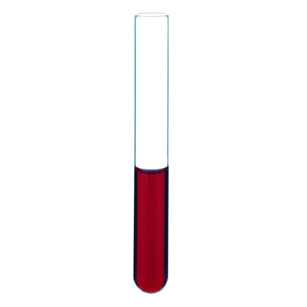

# Kimble

Kimble is a DWK Life Sciences brand of laboratory glassware.

## Tubes

| Description | Image | PLR definition |
|-|-|-|
| KIMBLE disposable rimless culture tube Catalog no.: 73500-1075 [manufacturer website](https://www.dwk.com/kimble-plain-disposable-borosilicate-glass-tube-10-x-75mm-4-ml-73500-1075) · [distributor website](https://www.sigmaaldrich.com/US/en/product/aldrich/dwk735001075) 51 expansion borosilicate glass (USP Type I, ASTM E438 Type I Class B) 10 mm OD × 75 mm; 4 mL overflow capacity Round bottom; rimless/plain neck; non-sterile; no marking spot 1000/case in shrink-wrapped trays; ASTM E890 |  | `Kimble_tube_4mL_Rb` |
