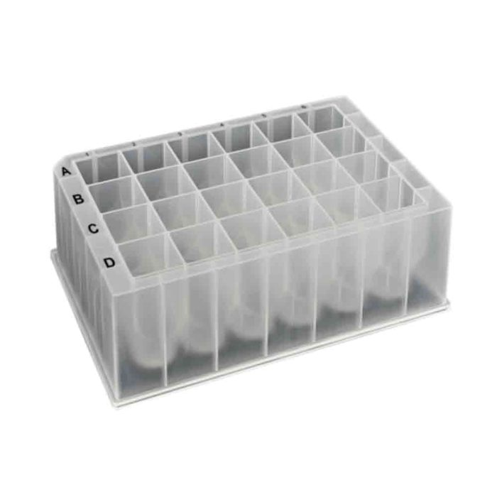

# MTC Bio

Company page: [MTC Bio](https://mtcbiotech.com/)

## Plates

| Description | Image | PLR definition |
|--------------------|--------------------|--------------------|
| `MTCBio_24_wellplate_10mL_Vb` Part no.: D3024-01 [manufacturer website](https://mtcbiotech.com/product/24-well-plates/) [drawing / distributor website](https://www.usplastic.com/catalog/item.aspx?itemid=153389) 24 square wells, 10 mL, 41.9 mm height, V-bottom, polypropylene Sealing mat: D3320-21 |  | `MTCBio_24_wellplate_10mL_Vb` |
